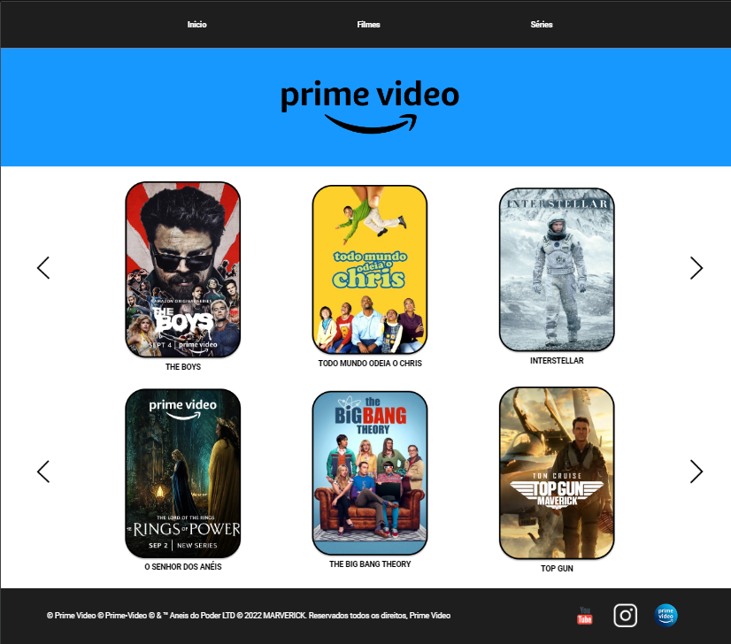
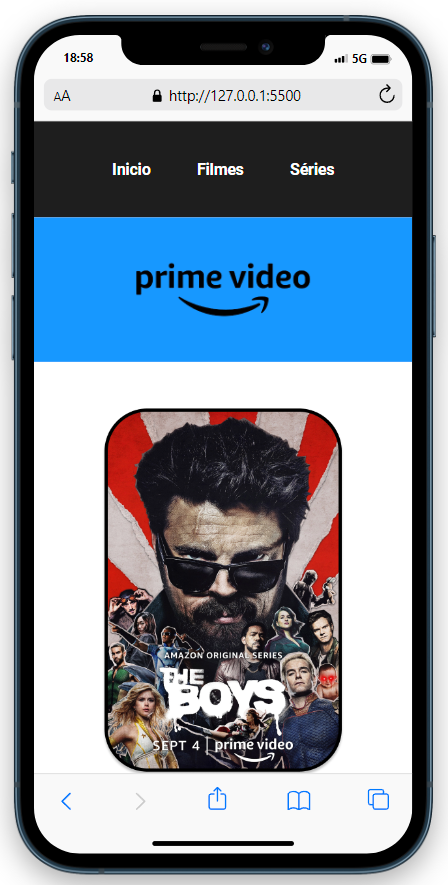
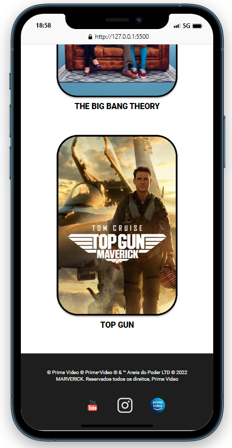

# Prime Video Clone

O projeto consiste em uma página web que replica a página inicial do Prime Video, com navegação, banners e cartões de filmes e séries. A página inclui links para as seções "Início", "Filmes" e "Séries".

## Tecnologias

O projeto foi construído utilizando as seguintes tecnologias:

* HTML: A estrutura da página foi criada com HTML.

* CSS: A formatação e o estilo da página foram definidos com CSS, tornando o layout visualmente atraente.

* Google Fonts: Foram utilizadas fontes do Google Fonts para estilização de textos.

## O Projeto

## Links

[GitHub](https://github.com/manoelarcanjo/clone-Prime-Video-1.0)

[Deploy](https://clone-prime-video-1-0.vercel.app/)

